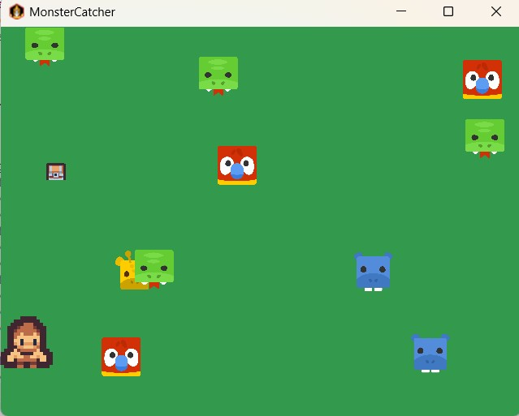
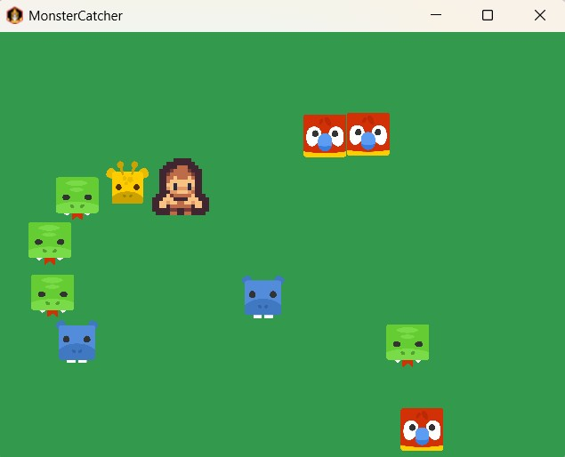

# Monster Catcher - 2D Java Game Study

An interactive 2D game built with **Java** and the **libGDX** framework. This project serves as a comprehensive case study for applying software engineering principles, memory optimization, and game architecture.

## 🚀 Key Features

*   **Custom Game Engine Architecture:** Implemented a robust OOP hierarchy using a base `GameObject` class and specific entity inheritance.
*   **Performance-Optimized Projectiles:** Leveraged **Object Pooling** for the `CaptureSphere` system to minimize Garbage Collection overhead and prevent frame-rate stutters.
*   **AI State Machine:** Monsters feature a **Finite State Machine (FSM)** with `WANDERING` and `CAPTURED` states, including random-walk AI and boundary-aware navigation.
*   **Follow-the-Leader Mechanics:** Captured monsters form a dynamic chain, utilizing vector math and distance-based steering to follow the player without stacking.
*   **Elemental Logic:** Integrated an `ElementType` system (Fire, Water, Grass, Electric) with built-in advantage logic (e.g., Water beats Fire).

## 🛠 Tech Stack

*   **Language:** Java 17
*   **Framework:** libGDX
*   **Build Tool:** Gradle
*   **Architecture:** Model-View-Controller (MVC) patterns and SOLID principles.

## 📸 Screenshots

| Player Movement & Monsters | Capturing Mechanics |
| :---: | :---: |
|  |  |
| *Wandering AI in action* | *Capture chain following the trainer* |

## 🧠 Technical Deep Dive

### Object Pooling
Instead of instantiating new objects on every click, the game retrieves spheres from a pre-allocated `Pool`. This is critical for mobile and desktop performance.
```java
// Example from the project
CaptureSphere sphere = spherePool.obtain();
sphere.init(originX, originY, direction);
Collision Detection
Uses AABB (Axis-Aligned Bounding Box) logic for efficient hit-testing between projectiles and monsters.

⚙️ How to Run
Clone the repository: git clone https://github.com/turbh11/MonsterCatcher.git

Open the project in Eclipse or IntelliJ as a Gradle Project.

Run the Lwjgl3Launcher.java file found in the lwjgl3 module.

A [libGDX](https://libgdx.com/) project generated with [gdx-liftoff](https://github.com/libgdx/gdx-liftoff).

This project was generated with a template including simple application launchers and an `ApplicationAdapter` extension that draws libGDX logo.

## Platforms

- `core`: Main module with the application logic shared by all platforms.
- `lwjgl3`: Primary desktop platform using LWJGL3; was called 'desktop' in older docs.

## Gradle

This project uses [Gradle](https://gradle.org/) to manage dependencies.
The Gradle wrapper was included, so you can run Gradle tasks using `gradlew.bat` or `./gradlew` commands.
Useful Gradle tasks and flags:

- `--continue`: when using this flag, errors will not stop the tasks from running.
- `--daemon`: thanks to this flag, Gradle daemon will be used to run chosen tasks.
- `--offline`: when using this flag, cached dependency archives will be used.
- `--refresh-dependencies`: this flag forces validation of all dependencies. Useful for snapshot versions.
- `build`: builds sources and archives of every project.
- `cleanEclipse`: removes Eclipse project data.
- `cleanIdea`: removes IntelliJ project data.
- `clean`: removes `build` folders, which store compiled classes and built archives.
- `eclipse`: generates Eclipse project data.
- `idea`: generates IntelliJ project data.
- `lwjgl3:jar`: builds application's runnable jar, which can be found at `lwjgl3/build/libs`.
- `lwjgl3:run`: starts the application.
- `test`: runs unit tests (if any).

Note that most tasks that are not specific to a single project can be run with `name:` prefix, where the `name` should be replaced with the ID of a specific project.
For example, `core:clean` removes `build` folder only from the `core` project.
